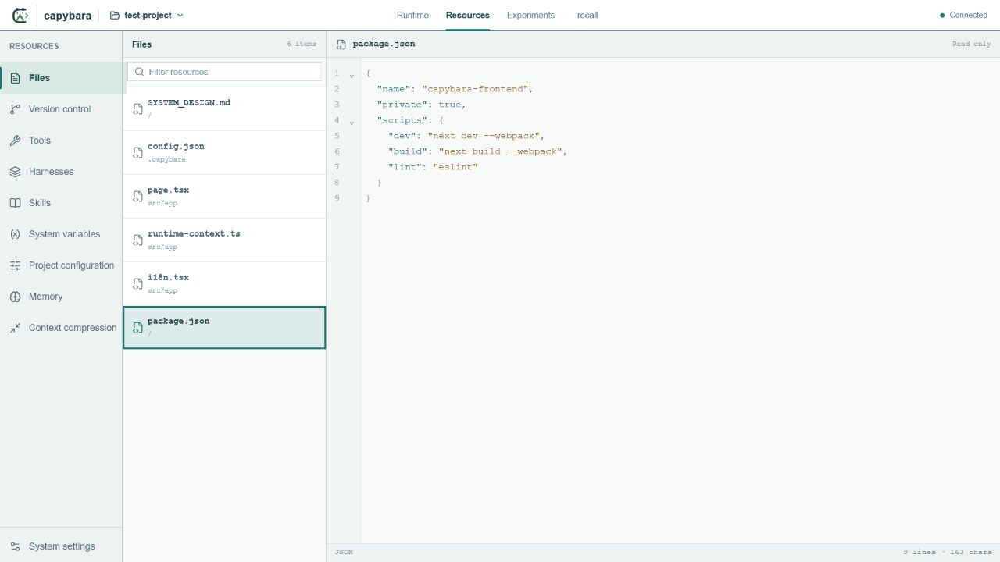

# Capybara

Capybara is a local-first system for building, observing, debugging, evaluating, and running tool-using AI agents.

Use the developer interface while authoring and training an Agent, then run the same project through the standalone local Runner without starting the Capybara UI. Browser and Node.js applications can connect through the framework-neutral TypeScript Client SDK.

The repository keeps the runtime service, developer interface, Client SDK, example projects, and shared protocol boundary in one workspace so implementation changes can be reviewed and tested atomically. Long-form engineering and research documentation is maintained in the companion `capybara-doc` repository.


Capybara keeps the full agent engineering loop visible: inspect live context and execution state, author project-scoped Tools, Harnesses, and Skills, then evaluate changes against datasets.

## What it provides

- A project format for Context templates, variables, Tools, Hooks, Skills, and Harnesses.
- A visible Runtime Loop with streaming output, Tool traces, artifacts, checkpoints, and Session restoration.
- Dataset-backed training, correction Hooks, replay, snapshots, held-out testing, and analysis.
- A standalone authenticated Runner for local deployment without the developer interface.
- A typed WebSocket Client SDK shared by browser and Node.js applications.
- Runtime Skill marketplace discovery with explicit user confirmation before installation or removal.
- Project Hooks with hot reload and validated, model-assisted prompt variable authoring.

## Interface tour

### Observe and debug the runtime

Inspect conversations, loaded context resources, runtime health, execution mode, and the step-by-step trace in one adjustable workspace.


### Author project resources

Browse project files and edit versioned agent resources with language-aware code views. Tools, Harnesses, and Skills have dedicated definitions, diagnostics, and test surfaces.



### Track experiments

Scope analysis to a dataset, then review overall trends, compare experiments, or inspect a single run from the same workspace.


## Repository layout

```text
apps/
  backend/            Fastify runtime and resource service
  frontend/           Next.js developer interface
examples/
  test-project/       Sanitized Tool, Skill, Harness, Dataset, and Context example
  appworld/           AppWorld training Hooks, adapter, runtime resources, and reproduction guide
packages/
  client/             Browser and Node.js WebSocket Client SDK
  protocol/           Shared Runtime commands, events, and state types
```

## Requirements

- Node.js 22 or newer
- npm 10 or newer

## Development

Install all workspace dependencies from the repository root:

```bash
npm install
```

Start Backend on port `3005` and Frontend on port `3000`:

```bash
npm run dev
```

The default project is `examples/test-project`. Add the LLM API Key from the Project configuration screen. The Key is written to `.capybara/secrets.json`, which is ignored by Git.

## Local Agent Runner

Run an Agent project without starting the Capybara developer interface. The Runner is published as `capybara-agent`:

```bash
npm install --global capybara-agent
capybara serve ./my-agent \
  --port 3210 \
  --token local-development-token \
  --allow-origin http://localhost:3000
```

To run without a global installation:

```bash
npx capybara-agent@latest serve ./my-agent --port 3210
```

When no fixed token is supplied, the Runner prints a generated access token. Check the service before connecting a client:

```bash
curl http://127.0.0.1:3210/v1/health
```

To run the same command from this repository during development:

```bash
npm run serve:agent -- examples/test-project \
  --port 3210 \
  --token local-development-token \
  --allow-origin http://localhost:3000
```

The Runner binds to `127.0.0.1` by default. If `--token` and
`CAPYBARA_RUNNER_TOKEN` are both omitted, it generates and prints a token at startup.
Session data is isolated under `<project>/.capybara/runtime` unless `--data-dir` is supplied.

The deployment surface is intentionally separate from the developer service:

```text
GET  /v1/health
GET  /v1/agent
GET  /v1/sessions
POST /v1/sessions
GET  /v1/sessions/:sessionId
PATCH /v1/sessions/:sessionId
WS   /v1/sessions/:sessionId/events
```

All endpoints except `/` and `/v1/health` require `Authorization: Bearer <token>`.
Browser WebSocket clients may pass the same token as the `access_token` query parameter.
Project editing, training, datasets, and experiment APIs are not mounted by the Runner.

Useful options:

```text
--host <host>             Bind address; defaults to 127.0.0.1
--port <port>             Listen port; defaults to 3210
--workspace <directory>   Tool workspace; defaults to the Agent project
--data-dir <directory>    Session data directory
--token <token>           Fixed access token
--allow-origin <origin>   Allowed browser origin; may be repeated
```

The current Runner reads an unpacked Capybara project directory. The future immutable
`*.capybara-agent` project Bundle format is separate from the `capybara-agent` npm package;
Bundle construction and installation are not implemented yet.

Hook source files import `defineHook` from `@capybara-agent/sdk`. This is a virtual module
provided by the Capybara Runtime when a Hook is loaded, not a separately installable npm package.

## Client SDK

The framework-neutral TypeScript client uses only `fetch`, `WebSocket`, and standard Web APIs.
It supports modern browsers and Node.js 22 or newer.

Install the published framework-neutral Client SDK:

```bash
npm install @capybara-agent/client
```

```ts
import { CapybaraClient } from '@capybara-agent/client'

const client = new CapybaraClient({
  endpoint: 'http://127.0.0.1:3210',
  token: 'your-local-token',
})
const session = await client.createSession({ name: 'My application' })

session.on('chat.assistant.delta', ({ payload }) => {
  if (payload.channel === 'final') console.log(payload.delta)
})

const completed = session.waitFor('chat.assistant.completed')
await session.sendMessage('Inspect the current workspace')
await completed

session.disconnect()
client.close()
```

The Client SDK exposes typed Runtime commands and events, automatic initial snapshots,
Session restoration, bounded reconnection, cancellation, and typed HTTP, connection, and
command errors. It has no React dependency.

Restore a persisted Session or issue a typed low-level Runtime command:

```ts
const restored = await client.connectSession(sessionId)

await restored.send('run.pause', {})
await restored.send('runtime.snapshot.get', {})
```

See [`packages/client/README.md`](packages/client/README.md) for the SDK API and error model.

## Runtime Skills

An Agent can search and preview GitHub Skills, inspect installed Skills, and request installation or removal through runtime system tools. File-changing operations never run directly from a model tool call. They create a confirmation card in the conversation, and the user must explicitly confirm or cancel the action.

Installation is pinned to a full Git commit SHA and revalidated immediately before files are written. System Skills inside `.capybara` cannot be removed, local modifications are surfaced as warnings, and confirmation state survives Session refresh and reconnection.

## AppWorld reproduction

The [`examples/appworld`](examples/appworld) project contains the training Hooks, official evaluator
adapter, runtime resources, dataset generator, state-diff helper, experiment launcher, and leaderboard
bundle tooling used by the `kecaipan capybara` submission.

Use the `appworld-official-2026-08-08` tag and follow the
[reproduction guide](examples/appworld/REPRODUCIBILITY.md) to recreate the environment and method.
The official workflow independently reported Normal TGC/SGC `85.1 / 73.2` and Challenge TGC/SGC
`73.4 / 52.5` in [AppWorld leaderboard PR #15](https://github.com/StonyBrookNLP/appworld-leaderboard/pull/15).

The public example contains code and sanitized aggregate context only. Benchmark downloads,
dataset projections, case evidence, local experiment workspaces, databases, and leaderboard bundles
remain excluded from Git.

## Verification

```bash
npm run typecheck
npm run lint
npm test
npm run build
```

Browser end-to-end tests are available separately:

```bash
npm run test:e2e
```

## Security

Do not commit `.env`, `.capybara/secrets.json`, session databases, experiment databases, logs, generated worktrees, benchmark downloads, or model-provider credentials. Example configuration uses non-routable placeholder service values.

## License

Capybara is licensed under the [Apache License 2.0](LICENSE).
