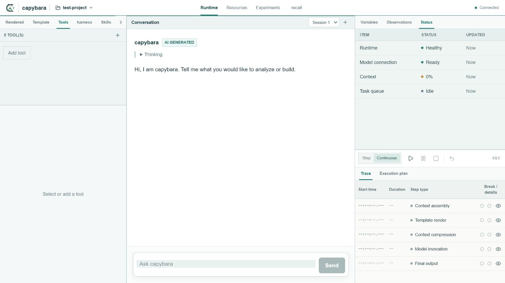
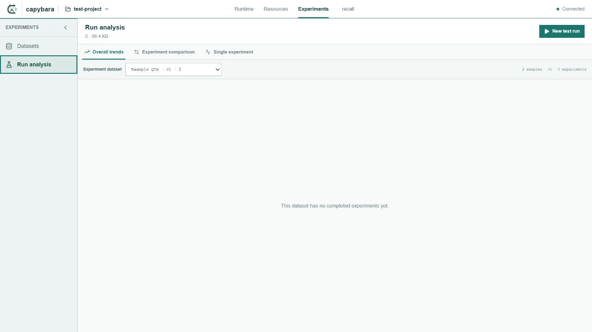

# Capybara

Capybara is a local-first development runtime for building, observing, debugging, and evaluating tool-using AI agents.

The repository keeps the runtime service, developer interface, example project, shared protocol boundary, and public engineering documents in one workspace so protocol changes can be reviewed and tested atomically.


Capybara keeps the full agent engineering loop visible: inspect live context and execution state, author project-scoped Tools, Harnesses, and Skills, then evaluate changes against datasets.

## Interface tour

### Observe and debug the runtime

Inspect conversations, loaded context resources, runtime health, execution mode, and the step-by-step trace in one adjustable workspace.



### Author project resources

Browse project files and edit versioned agent resources with language-aware code views. Tools, Harnesses, and Skills have dedicated definitions, diagnostics, and test surfaces.


### Track experiments

Scope analysis to a dataset, then review overall trends, compare experiments, or inspect a single run from the same workspace.



## Repository layout

```text
apps/
  backend/            Fastify runtime and resource service
  frontend/           Next.js developer interface
examples/
  test-project/       Sanitized Tool, Skill, Harness, Dataset, and Context example
packages/
  protocol/           Reserved shared runtime protocol package
docs/                 Public architecture and protocol documents
```

AppWorld benchmark data and local experiment workspaces are intentionally not part of this repository.

## Requirements

- Node.js 22 or newer
- npm 10 or newer

## Development

Install all workspace dependencies from the repository root:

```bash
npm install
```

Start Backend on port `3005` and Frontend on port `3000`:

```bash
npm run dev
```

The default project is `examples/test-project`. Add the LLM API Key from the Project configuration screen. The Key is written to `.capybara/secrets.json`, which is ignored by Git.

## Verification

```bash
npm run typecheck
npm run lint
npm test
npm run build
```

Browser end-to-end tests are available separately:

```bash
npm run test:e2e
```

## Security

Do not commit `.env`, `.capybara/secrets.json`, session databases, experiment databases, logs, generated worktrees, benchmark downloads, or model-provider credentials. Example configuration uses non-routable placeholder service values.

## License

Capybara is licensed under the [Apache License 2.0](LICENSE).
